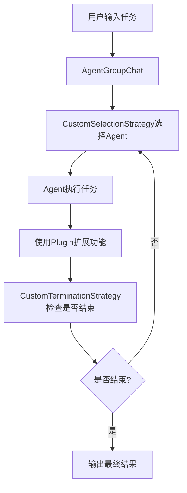
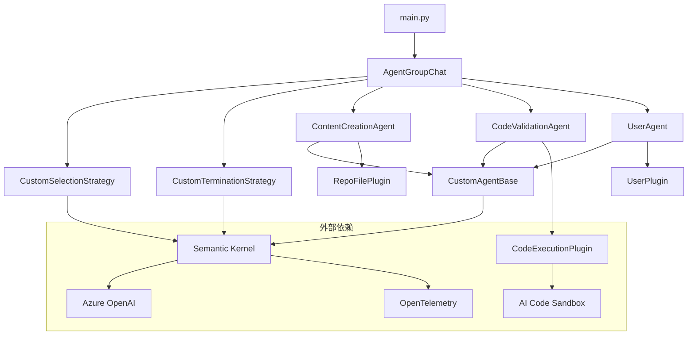

# Semantic Kernel 学习指南

## 📚 目录

- [Semantic Kernel 学习指南](#semantic-kernel-学习指南)
  - [📚 目录](#-目录)
  - [🎯 Semantic Kernel 核心概念详解](#-semantic-kernel-核心概念详解)
    - [1. 什么是Semantic Kernel？](#1-什么是semantic-kernel)
    - [2. 核心架构组件](#2-核心架构组件)
      - [Agent（代理）](#agent代理)
      - [Plugin（插件）](#plugin插件)
      - [Strategy（策略）](#strategy策略)
      - [FunctionChoiceBehavior（函数选择行为）](#functionchoicebehavior函数选择行为)
    - [3. 项目架构深度分析](#3-项目架构深度分析)
      - [项目工作流程](#项目工作流程)
      - [Agent详细分析](#agent详细分析)
      - [Plugin详细分析](#plugin详细分析)
      - [Strategy详细分析](#strategy详细分析)
    - [4. 关键技术特性](#4-关键技术特性)
      - [遥测和监控](#遥测和监控)
      - [异步编程](#异步编程)
      - [类型安全](#类型安全)
    - [5. 学习路径建议](#5-学习路径建议)
      - [第一阶段：基础理解](#第一阶段基础理解)
      - [第二阶段：实践操作](#第二阶段实践操作)
      - [第三阶段：扩展功能](#第三阶段扩展功能)
    - [6. 项目改造建议](#6-项目改造建议)
      - [可以改造的方向](#可以改造的方向)
      - [学习重点](#学习重点)
  - [🏗️ 项目结构分析](#️-项目结构分析)
    - [核心文件说明](#核心文件说明)
    - [依赖关系图](#依赖关系图)
  - [🔧 代码示例和最佳实践](#-代码示例和最佳实践)
    - [创建自定义Agent](#创建自定义agent)
    - [创建自定义Plugin](#创建自定义plugin)
    - [自定义选择策略](#自定义选择策略)
    - [自定义终止策略](#自定义终止策略)
  - [🚀 快速开始](#-快速开始)
    - [环境配置](#环境配置)
    - [运行项目](#运行项目)
    - [项目定制](#项目定制)
  - [📖 深入理解](#-深入理解)
    - [ChatCompletionAgent核心机制](#chatcompletionagent核心机制)
    - [函数调用机制](#函数调用机制)
    - [消息流处理](#消息流处理)
  - [🛠️ 进阶开发](#️-进阶开发)
    - [扩展Agent能力](#扩展agent能力)
    - [集成外部服务](#集成外部服务)
    - [性能优化](#性能优化)
  - [📋 总结](#-总结)

## 🎯 Semantic Kernel 核心概念详解

### 1. 什么是Semantic Kernel？

Semantic Kernel是微软开发的一个开源SDK，用于将AI大语言模型（如GPT、Claude等）集成到应用程序中。它提供了一个统一的框架来：

- **管理AI服务连接**：支持多种AI服务提供商（OpenAI、Azure OpenAI、Anthropic等）
- **创建和编排AI代理**：通过Agent模式实现特定功能的AI助手
- **实现插件系统**：为Agent提供具体的工具和能力
- **处理提示词和对话历史**：管理复杂的对话流程

### 2. 核心架构组件

#### Agent（代理）

**定义**：具有特定技能和职责的AI实体

**特点**：
- 每个Agent都有明确的指令（instructions）和描述（description）
- 可以配置特定的插件（plugins）
- 支持不同的AI服务后端

**本项目中的三个Agent**：
1. **ContentCreationAgent**：负责创建和修改文档内容
2. **CodeValidationAgent**：负责验证文档中的代码
3. **UserAgent**：负责与用户交互获取反馈

#### Plugin（插件）

**定义**：为Agent提供具体功能的工具集

**实现方式**：
- 通过`@kernel_function`装饰器定义函数
- 函数参数和返回值使用类型注解
- 支持异步操作

**本项目中的三个Plugin**：
1. **RepoFilePlugin**：读取文件系统中的文件
2. **CodeExecutionPlugin**：在沙盒环境中执行Python代码
3. **UserPlugin**：与用户进行交互

#### Strategy（策略）

**定义**：控制Agent协作流程的策略模式

**类型**：
- **SelectionStrategy**：决定下一个应该激活的Agent
- **TerminationStrategy**：决定对话何时结束

#### FunctionChoiceBehavior（函数选择行为）

**定义**：控制Agent如何选择和调用函数的行为策略

**类型**：
- **Auto()**：自动选择合适的函数
- **Required()**：必须调用函数
- **None()**：不调用任何函数

### 3. 项目架构深度分析

#### 项目工作流程



#### Agent详细分析

**1. CustomAgentBase（基础Agent类）**

```python
class CustomAgentBase(ChatCompletionAgent, ABC):
    """
    核心功能：
    - 统一的AI服务创建（支持OpenAI和Azure OpenAI）
    - 消息标准化处理
    - 过滤空消息避免污染上下文
    """
    
    def _create_ai_service(self, service: Services = Services.AZURE_OPENAI):
        """创建AI服务实例"""
        # 支持多种AI服务提供商
        
    def _normalize_messages(self, messages):
        """标准化消息格式"""
        # 将字符串转换为ChatMessageContent对象
```

**2. ContentCreationAgent（内容创建Agent）**

```python
class ContentCreationAgent(CustomAgentBase):
    """
    职责：生成和修改技术文档
    插件：RepoFilePlugin（可以读取仓库文件作为参考）
    特点：每次调用都会添加额外的用户消息来指导内容创建
    """
    
    INSTRUCTION = """
    You are part of a chat with multiple agents focused on creating technical content.
    Your task is to generate informative and engaging technical content...
    """
```

**3. CodeValidationAgent（代码验证Agent）**

```python
class CodeValidationAgent(CustomAgentBase):
    """
    职责：验证文档中的Python代码
    插件：CodeExecutionPlugin（在沙盒环境中执行代码）
    特点：只验证不修复，将错误信息反馈给内容创建Agent
    """
    
    INSTRUCTION = """
    You are a code validation agent in a collaborative document creation chat.
    Your task is to validate Python code in the latest document draft...
    """
```

**4. UserAgent（用户交互Agent）**

```python
class UserAgent(CustomAgentBase):
    """
    职责：向用户展示草稿并收集反馈
    插件：UserPlugin（与用户进行交互）
    特点：作为人机交互的桥梁
    """
    
    INSTRUCTION = """
    You are part of a chat with multiple agents working on a document.
    Your task is to summarize the user's feedback on the latest draft...
    """
```

#### Plugin详细分析

**1. RepoFilePlugin**

```python
class RepoFilePlugin:
    """文件系统操作插件"""
    
    @kernel_function(description="Read a file given a relative path")
    def read_file_by_path(self, path: str) -> str:
        """根据相对路径读取文件"""
        
    @kernel_function(description="Read a file given the name of the file")
    def read_file_by_name(self, file_name: str) -> str:
        """根据文件名搜索并读取文件"""
        
    @kernel_function(description="List all files or subdirectories")
    def list_directory(self, path: str) -> str:
        """列出目录中的文件和子目录"""
```

**2. CodeExecutionPlugin**

```python
class CodeExecutionPlugin:
    """代码执行插件"""
    
    @kernel_function(description="Run a Python code snippet")
    def run(self, code: str) -> str:
        """在沙盒环境中执行Python代码"""
        sandbox = AICodeSandbox(
            custom_image="python:3.12-slim",
            packages=["semantic_kernel"],
        )
        return sandbox.run_code(code)
```

**3. UserPlugin**

```python
class UserPlugin:
    """用户交互插件"""
    
    @kernel_function(description="Present content to user and request feedback")
    def request_user_feedback(self, content: str) -> str:
        """向用户展示内容并请求反馈"""
        return input(f"Please provide feedback on:\n\n{content}\n\n> ")
```

#### Strategy详细分析

**1. CustomSelectionStrategy**

```python
class CustomSelectionStrategy(SelectionStrategy):
    """智能Agent选择策略"""
    
    async def next(self, agents: list["Agent"], history: list["ChatMessageContent"]) -> "Agent":
        """
        智能选择策略：
        - 使用AI模型分析对话历史
        - 按照预定义的工作流程选择下一个Agent
        - 工作流程：内容创建 → 代码验证 → 内容修改 → 代码验证 → 用户反馈
        """
        
    def get_system_message(self, agents: list["Agent"]) -> str:
        """定义Agent选择的系统提示"""
        return """
        The conversation must follow these steps:
        1. The content creation agent writes a draft.
        2. The code validation agent checks the code in the draft.
        3. The content creation agent updates the draft based on the feedback.
        ...
        """
```

**2. CustomTerminationStrategy**

```python
class CustomTerminationStrategy(TerminationStrategy):
    """对话终止策略"""
    
    async def should_agent_terminate(self, agent: "Agent", history: list["ChatMessageContent"]) -> bool:
        """
        终止条件：
        - 达到最大迭代次数（20次）
        - AI判断所有Agent都满意当前内容
        - 使用特定关键词（"yes"/"no"）来判断是否终止
        """
```

### 4. 关键技术特性

#### 遥测和监控

```python
# 集成OpenTelemetry进行分布式追踪
from opentelemetry import trace
from azure.monitor.opentelemetry.exporter import AzureMonitorTraceExporter

# 支持Azure Application Insights
def set_up_tracing():
    tracer_provider = TracerProvider(resource=resource)
    tracer_provider.add_span_processor(
        BatchSpanProcessor(AzureMonitorTraceExporter(connection_string=CONNECTION_STRING))
    )
```

#### 异步编程

```python
# 全面使用async/await模式
async def invoke(self, messages: str | ChatMessageContent | None = None) -> AsyncIterable[AgentResponseItem]:
    """支持流式响应处理"""
    
# 高并发处理能力
async for response in group_chat.invoke():
    print(f"==== {response.name} just responded ====")
```

#### 类型安全

```python
# 使用Pydantic进行数据验证
from pydantic import Field, model_validator

# 完整的类型注解
function_choice_behavior: FunctionChoiceBehavior | None = Field(
    default_factory=lambda: FunctionChoiceBehavior.Auto()
)

# 支持Python 3.12+的新特性
if sys.version_info >= (3, 12):
    from typing import override
else:
    from typing_extensions import override
```

### 5. 学习路径建议

#### 第一阶段：基础理解

1. **理解Agent概念**
   - 每个Agent都是一个专门的AI助手
   - Agent有明确的职责分工
   - Agent之间可以协作完成复杂任务

2. **理解Plugin概念**
   - Plugin为Agent提供具体的能力
   - 通过`@kernel_function`装饰器定义
   - 支持类型注解和文档字符串

3. **理解对话流程**
   - Agent之间如何协作完成任务
   - 消息如何在Agent之间传递
   - 如何控制对话的流程和终止

#### 第二阶段：实践操作

1. **修改Agent指令**
   ```python
   # 尝试修改INSTRUCTION常量
   INSTRUCTION = """
   你是一个专门的技术文档创建助手...
   """
   ```

2. **添加新Plugin**
   ```python
   class MyCustomPlugin:
       @kernel_function(description="My custom function")
       def my_function(self, input_text: str) -> str:
           # 实现自定义逻辑
           return processed_text
   ```

3. **调整Strategy**
   ```python
   # 修改Agent选择和终止逻辑
   class MyCustomSelectionStrategy(SelectionStrategy):
       async def next(self, agents, history):
           # 实现自定义选择逻辑
           pass
   ```

#### 第三阶段：扩展功能

1. **添加新Agent**
   ```python
   class TranslationAgent(CustomAgentBase):
       """翻译Agent"""
       def __init__(self):
           super().__init__(
               service=self._create_ai_service(Services.AZURE_OPENAI),
               plugins=[TranslationPlugin()],
               name="TranslationAgent",
               instructions="You are a translation agent...",
           )
   ```

2. **集成外部服务**
   ```python
   class DatabasePlugin:
       @kernel_function(description="Query database")
       async def query_database(self, sql: str) -> str:
           # 集成数据库查询
           pass
   ```

3. **优化性能**
   ```python
   # 改进缓存、并发处理等
   class CachedPlugin:
       def __init__(self):
           self.cache = {}
           
       @kernel_function(description="Cached function")
       async def cached_function(self, input_data: str) -> str:
           if input_data in self.cache:
               return self.cache[input_data]
           # 处理逻辑
           result = await self.process(input_data)
           self.cache[input_data] = result
           return result
   ```

### 6. 项目改造建议

#### 可以改造的方向

1. **添加更多Agent类型**
   - 翻译Agent：支持多语言翻译
   - 格式化Agent：统一文档格式
   - 图片生成Agent：生成图表和图像
   - 数据分析Agent：分析数据并生成报告

2. **扩展Plugin功能**
   - 数据库查询Plugin：连接各种数据库
   - API调用Plugin：调用外部API服务
   - 文件操作Plugin：更强大的文件处理能力
   - 网络爬虫Plugin：获取网络数据

3. **改进用户交互**
   - Web界面：使用Streamlit或Gradio
   - 语音交互：集成语音识别和合成
   - 实时协作：支持多用户实时编辑

4. **增强监控能力**
   - 实时监控：Agent执行状态监控
   - 性能分析：响应时间和资源使用分析
   - 错误追踪：详细的错误日志和追踪

5. **支持更多AI模型**
   - 本地模型：集成Ollama、LM Studio等
   - 其他云服务：Google Vertex AI、AWS Bedrock等
   - 多模态模型：支持图像、音频等多种输入

#### 学习重点

- **Agent的设计模式**：如何设计职责单一、协作良好的Agent
- **Plugin的扩展机制**：如何为Agent添加新的能力
- **异步编程模式**：如何处理并发和流式数据
- **提示词工程**：如何编写有效的Agent指令

## 🏗️ 项目结构分析

### 核心文件说明

```
document_generator/
├── main.py                          # 主程序入口
├── requirements.txt                 # 项目依赖
├── README.md                       # 项目说明
├── 运行指南.md                     # 中文运行指南
├── debug_env.py                    # 调试环境配置
├── test_azure_openai.py            # Azure OpenAI测试
├── test_connection.py              # 连接测试
├── custom_selection_strategy.py    # 自定义选择策略
├── custom_termination_strategy.py  # 自定义终止策略
├── GENERATED_DOCUMENT.md          # 生成的文档示例
├── agents/                         # Agent定义目录
│   ├── custom_agent_base.py        # Agent基础类
│   ├── content_creation_agent.py   # 内容创建Agent
│   ├── code_validation_agent.py    # 代码验证Agent
│   └── user_agent.py               # 用户交互Agent
└── plugins/                        # Plugin定义目录
    ├── repo_file_plugin.py         # 文件操作Plugin
    ├── code_execution_plugin.py    # 代码执行Plugin
    └── user_plugin.py              # 用户交互Plugin
```

### 依赖关系图



## 🔧 代码示例和最佳实践

### 创建自定义Agent

```python
from agents.custom_agent_base import CustomAgentBase, Services
from plugins.my_custom_plugin import MyCustomPlugin

class MyCustomAgent(CustomAgentBase):
    """自定义Agent示例"""
    
    def __init__(self):
        super().__init__(
            service=self._create_ai_service(Services.AZURE_OPENAI),
            plugins=[MyCustomPlugin()],
            name="MyCustomAgent",
            instructions="""
            你是一个专门的助手，负责处理特定的任务。
            请按照以下步骤执行：
            1. 分析用户输入
            2. 执行相应的操作
            3. 返回结果
            """.strip(),
            description="选择我来处理特定的任务。",
        )

    @override
    async def invoke(self, **kwargs):
        """重写invoke方法添加自定义逻辑"""
        # 添加自定义的预处理逻辑
        additional_message = "现在开始处理任务..."
        
        async for response in super().invoke(
            additional_user_message=additional_message,
            **kwargs
        ):
            # 添加自定义的后处理逻辑
            yield response
```

### 创建自定义Plugin

```python
from typing import Annotated
from semantic_kernel.functions import kernel_function
import asyncio
import aiohttp

class MyCustomPlugin:
    """自定义Plugin示例"""
    
    def __init__(self):
        self.session = None
    
    @kernel_function(description="获取网页内容")
    async def fetch_webpage(
        self, 
        url: Annotated[str, "要获取的网页URL"]
    ) -> Annotated[str, "返回网页内容"]:
        """获取网页内容"""
        if not self.session:
            self.session = aiohttp.ClientSession()
        
        try:
            async with self.session.get(url) as response:
                if response.status == 200:
                    content = await response.text()
                    return content[:1000]  # 限制返回长度
                else:
                    return f"错误：HTTP {response.status}"
        except Exception as e:
            return f"错误：{str(e)}"
    
    @kernel_function(description="处理JSON数据")
    def process_json(
        self, 
        json_data: Annotated[str, "JSON格式的数据"]
    ) -> Annotated[str, "处理后的结果"]:
        """处理JSON数据"""
        import json
        try:
            data = json.loads(json_data)
            # 自定义处理逻辑
            processed = {
                "count": len(data) if isinstance(data, (list, dict)) else 1,
                "type": type(data).__name__,
                "summary": str(data)[:100]
            }
            return json.dumps(processed, ensure_ascii=False, indent=2)
        except json.JSONDecodeError as e:
            return f"JSON解析错误：{str(e)}"
    
    @kernel_function(description="执行数学计算")
    def calculate(
        self, 
        expression: Annotated[str, "数学表达式"]
    ) -> Annotated[str, "计算结果"]:
        """安全的数学计算"""
        import ast
        import operator
        
        # 支持的操作符
        operators = {
            ast.Add: operator.add,
            ast.Sub: operator.sub,
            ast.Mult: operator.mul,
            ast.Div: operator.truediv,
            ast.Pow: operator.pow,
            ast.USub: operator.neg,
        }
        
        def eval_expr(node):
            if isinstance(node, ast.Constant):
                return node.value
            elif isinstance(node, ast.BinOp):
                return operators[type(node.op)](eval_expr(node.left), eval_expr(node.right))
            elif isinstance(node, ast.UnaryOp):
                return operators[type(node.op)](eval_expr(node.operand))
            else:
                raise TypeError(f"不支持的操作：{type(node)}")
        
        try:
            tree = ast.parse(expression, mode='eval')
            result = eval_expr(tree.body)
            return str(result)
        except Exception as e:
            return f"计算错误：{str(e)}"
    
    async def __aenter__(self):
        if not self.session:
            self.session = aiohttp.ClientSession()
        return self
    
    async def __aexit__(self, exc_type, exc_val, exc_tb):
        if self.session:
            await self.session.close()
```

### 自定义选择策略

```python
from typing import TYPE_CHECKING
from semantic_kernel.agents.strategies.selection.selection_strategy import SelectionStrategy
from semantic_kernel.contents import ChatHistory

if TYPE_CHECKING:
    from semantic_kernel.agents import Agent
    from semantic_kernel.contents.chat_message_content import ChatMessageContent

class RoundRobinSelectionStrategy(SelectionStrategy):
    """轮询选择策略"""
    
    def __init__(self):
        self.current_index = 0
    
    async def next(self, agents: list["Agent"], history: list["ChatMessageContent"]) -> "Agent":
        """轮询选择下一个Agent"""
        if not agents:
            raise ValueError("没有可选择的Agent")
        
        # 简单的轮询策略
        selected_agent = agents[self.current_index]
        self.current_index = (self.current_index + 1) % len(agents)
        
        return selected_agent

class PrioritySelectionStrategy(SelectionStrategy):
    """优先级选择策略"""
    
    def __init__(self, priority_map: dict[str, int]):
        """
        Args:
            priority_map: Agent名称到优先级的映射，数字越小优先级越高
        """
        self.priority_map = priority_map
    
    async def next(self, agents: list["Agent"], history: list["ChatMessageContent"]) -> "Agent":
        """根据优先级选择Agent"""
        if not agents:
            raise ValueError("没有可选择的Agent")
        
        # 按优先级排序
        sorted_agents = sorted(
            agents, 
            key=lambda agent: self.priority_map.get(agent.name, 999)
        )
        
        # 简单选择最高优先级的Agent
        return sorted_agents[0]

class ConditionalSelectionStrategy(SelectionStrategy):
    """条件选择策略"""
    
    async def next(self, agents: list["Agent"], history: list["ChatMessageContent"]) -> "Agent":
        """根据条件选择Agent"""
        if not agents:
            raise ValueError("没有可选择的Agent")
        
        # 分析最后几条消息
        recent_messages = history[-3:] if len(history) >= 3 else history
        
        # 如果最近的消息包含代码，选择代码验证Agent
        for msg in recent_messages:
            if "```" in msg.content:
                code_agents = [agent for agent in agents if "code" in agent.name.lower()]
                if code_agents:
                    return code_agents[0]
        
        # 如果最近的消息包含反馈请求，选择用户Agent
        for msg in recent_messages:
            if any(keyword in msg.content.lower() for keyword in ["feedback", "review", "opinion"]):
                user_agents = [agent for agent in agents if "user" in agent.name.lower()]
                if user_agents:
                    return user_agents[0]
        
        # 默认选择内容创建Agent
        content_agents = [agent for agent in agents if "content" in agent.name.lower()]
        if content_agents:
            return content_agents[0]
        
        # 如果没有匹配的Agent，选择第一个
        return agents[0]
```

### 自定义终止策略

```python
from typing import TYPE_CHECKING
from semantic_kernel.agents.strategies import TerminationStrategy

if TYPE_CHECKING:
    from semantic_kernel.agents.agent import Agent
    from semantic_kernel.contents.chat_message_content import ChatMessageContent

class MaxIterationsTerminationStrategy(TerminationStrategy):
    """最大迭代次数终止策略"""
    
    def __init__(self, max_iterations: int = 10):
        self.max_iterations = max_iterations
        self.current_iterations = 0
    
    async def should_agent_terminate(self, agent: "Agent", history: list["ChatMessageContent"]) -> bool:
        """检查是否应该终止"""
        self.current_iterations += 1
        
        if self.current_iterations >= self.max_iterations:
            print(f"达到最大迭代次数 {self.max_iterations}，终止对话")
            return True
        
        return False

class KeywordTerminationStrategy(TerminationStrategy):
    """关键词终止策略"""
    
    def __init__(self, termination_keywords: list[str]):
        self.termination_keywords = [keyword.lower() for keyword in termination_keywords]
    
    async def should_agent_terminate(self, agent: "Agent", history: list["ChatMessageContent"]) -> bool:
        """检查最近的消息是否包含终止关键词"""
        if not history:
            return False
        
        last_message = history[-1]
        content = last_message.content.lower()
        
        for keyword in self.termination_keywords:
            if keyword in content:
                print(f"检测到终止关键词 '{keyword}'，终止对话")
                return True
        
        return False

class CompletionTerminationStrategy(TerminationStrategy):
    """完成度终止策略"""
    
    def __init__(self, required_agents: list[str]):
        """
        Args:
            required_agents: 必须参与对话的Agent名称列表
        """
        self.required_agents = required_agents
        self.participated_agents = set()
    
    async def should_agent_terminate(self, agent: "Agent", history: list["ChatMessageContent"]) -> bool:
        """检查是否所有必需的Agent都参与了对话"""
        # 记录参与的Agent
        if agent.name in self.required_agents:
            self.participated_agents.add(agent.name)
        
        # 检查是否所有必需的Agent都参与了
        if len(self.participated_agents) >= len(self.required_agents):
            # 检查最近的消息质量
            if len(history) >= 3:
                recent_messages = history[-3:]
                # 如果最近的消息都比较长且有实质内容，认为任务完成
                if all(len(msg.content) > 50 for msg in recent_messages):
                    print("所有必需的Agent都参与了对话且产生了有效内容，终止对话")
                    return True
        
        return False
```

## 🚀 快速开始

### 环境配置

1. **安装依赖**
```bash
pip install -r requirements.txt
```

2. **配置环境变量**
```bash
# 创建.env文件
cp .env.example .env

# 编辑.env文件，添加以下配置
AZURE_OPENAI_CHAT_DEPLOYMENT_NAME=your-deployment-name
AZURE_OPENAI_ENDPOINT=https://your-resource.openai.azure.com/
AZURE_OPENAI_API_KEY=your-api-key
AZURE_OPENAI_API_VERSION=2024-10-21

# 可选：Azure Application Insights
AZURE_APP_INSIGHTS_CONNECTION_STRING=your-connection-string
```

### 运行项目

```bash
# 直接运行
python main.py

# 或使用调试模式
python debug_env.py
```

### 项目定制

1. **修改任务描述**
```python
# 在main.py中修改TASK变量
TASK = """
你的自定义任务描述...
"""
```

2. **添加新的Agent**
```python
# 在agents/目录下创建新的Agent
from agents.custom_agent_base import CustomAgentBase

class MyNewAgent(CustomAgentBase):
    # 实现自定义逻辑
    pass

# 在main.py中注册
agents = [
    ContentCreationAgent(),
    CodeValidationAgent(),
    UserAgent(),
    MyNewAgent(),  # 添加新的Agent
]
```

3. **修改选择策略**
```python
# 在custom_selection_strategy.py中修改逻辑
def get_system_message(self, agents: list["Agent"]) -> str:
    return """
    你的自定义选择逻辑...
    """
```

## 📖 深入理解

### ChatCompletionAgent核心机制

```python
class ChatCompletionAgent(Agent):
    """聊天完成Agent的核心实现"""
    
    # 函数选择行为配置
    function_choice_behavior: FunctionChoiceBehavior | None = Field(
        default_factory=lambda: FunctionChoiceBehavior.Auto()
    )
    
    async def invoke(self, messages=None, **kwargs) -> AsyncIterable[AgentResponseItem]:
        """
        核心调用流程：
        1. 准备聊天历史
        2. 格式化Agent指令
        3. 调用AI服务
        4. 处理响应和函数调用
        5. 返回结果
        """
        # 准备聊天历史
        chat_history = ChatHistory()
        async for message in thread.get_messages():
            chat_history.add_message(message)
        
        # 格式化Agent指令
        agent_chat_history = await self._prepare_agent_chat_history(
            history=chat_history,
            kernel=kernel,
            arguments=arguments,
        )
        
        # 调用AI服务
        responses = await chat_completion_service.get_chat_message_contents(
            chat_history=agent_chat_history,
            settings=settings,
            kernel=kernel,
            arguments=arguments,
        )
        
        # 处理响应
        for response in responses:
            response.name = self.name
            yield response
```

### 函数调用机制

```python
class FunctionChoiceBehavior:
    """函数选择行为控制"""
    
    @staticmethod
    def Auto():
        """自动选择函数"""
        return FunctionChoiceBehavior(type="auto")
    
    @staticmethod
    def Required():
        """必须调用函数"""
        return FunctionChoiceBehavior(type="required")
    
    @staticmethod
    def None():
        """不调用函数"""
        return FunctionChoiceBehavior(type="none")

# 在Agent中使用
class MyAgent(ChatCompletionAgent):
    def __init__(self):
        super().__init__(
            # 配置函数选择行为
            function_choice_behavior=FunctionChoiceBehavior.Auto(),
            plugins=[MyPlugin()],
        )
```

### 消息流处理

```python
async def _inner_invoke(self, thread, history, **kwargs):
    """内部调用处理流程"""
    
    # 1. 准备Agent聊天历史
    agent_chat_history = await self._prepare_agent_chat_history(
        history=history,
        kernel=kernel,
        arguments=arguments,
    )
    
    # 2. 调用AI服务
    responses = await chat_completion_service.get_chat_message_contents(
        chat_history=agent_chat_history,
        settings=settings,
        kernel=kernel,
        arguments=arguments,
    )
    
    # 3. 处理新增的工具消息
    new_msgs = await self._drain_mutated_messages(
        agent_chat_history,
        start_idx,
        thread,
    )
    
    # 4. 触发中间消息回调
    if on_intermediate_message:
        for msg in new_msgs:
            await on_intermediate_message(msg)
    
    # 5. 返回响应
    for response in responses:
        response.name = self.name
        if response.role != AuthorRole.TOOL:
            await thread.on_new_message(response)
        yield response
```

## 🛠️ 进阶开发

### 扩展Agent能力

```python
class AdvancedContentAgent(CustomAgentBase):
    """高级内容Agent"""
    
    def __init__(self):
        super().__init__(
            service=self._create_ai_service(Services.AZURE_OPENAI),
            plugins=[
                RepoFilePlugin(),
                WebSearchPlugin(),
                ImageGenerationPlugin(),
                DataAnalysisPlugin(),
            ],
            name="AdvancedContentAgent",
            instructions="""
            你是一个高级内容创建助手，具备以下能力：
            1. 文件读取和分析
            2. 网络搜索和信息收集
            3. 图像生成和处理
            4. 数据分析和可视化
            
            请根据用户需求选择合适的工具来完成任务。
            """,
        )
    
    async def invoke(self, **kwargs):
        """增强的调用方法"""
        # 预处理：分析任务类型
        task_type = await self._analyze_task_type(kwargs.get('messages'))
        
        # 根据任务类型调整function_choice_behavior
        if task_type == 'data_analysis':
            self.function_choice_behavior = FunctionChoiceBehavior.Required()
        elif task_type == 'simple_text':
            self.function_choice_behavior = FunctionChoiceBehavior.None()
        else:
            self.function_choice_behavior = FunctionChoiceBehavior.Auto()
        
        # 执行标准调用流程
        async for response in super().invoke(**kwargs):
            # 后处理：增强响应
            enhanced_response = await self._enhance_response(response)
            yield enhanced_response
    
    async def _analyze_task_type(self, messages):
        """分析任务类型"""
        # 实现任务类型分析逻辑
        pass
    
    async def _enhance_response(self, response):
        """增强响应"""
        # 实现响应增强逻辑
        return response
```

### 集成外部服务

```python
class ExternalServicePlugin:
    """外部服务集成插件"""
    
    def __init__(self):
        self.database_client = None
        self.api_client = None
    
    @kernel_function(description="查询数据库")
    async def query_database(
        self, 
        query: Annotated[str, "SQL查询语句"]
    ) -> Annotated[str, "查询结果"]:
        """查询数据库"""
        if not self.database_client:
            # 初始化数据库连接
            self.database_client = await self._init_database_client()
        
        try:
            results = await self.database_client.execute(query)
            return self._format_results(results)
        except Exception as e:
            return f"数据库查询错误：{str(e)}"
    
    @kernel_function(description="调用外部API")
    async def call_external_api(
        self, 
        endpoint: Annotated[str, "API端点"],
        method: Annotated[str, "HTTP方法"] = "GET",
        data: Annotated[str, "请求数据"] = None
    ) -> Annotated[str, "API响应"]:
        """调用外部API"""
        if not self.api_client:
            self.api_client = await self._init_api_client()
        
        try:
            response = await self.api_client.request(
                method=method,
                url=endpoint,
                data=data
            )
            return response.text
        except Exception as e:
            return f"API调用错误：{str(e)}"
    
    async def _init_database_client(self):
        """初始化数据库客户端"""
        # 实现数据库连接逻辑
        pass
    
    async def _init_api_client(self):
        """初始化API客户端"""
        # 实现API客户端初始化逻辑
        pass
    
    def _format_results(self, results):
        """格式化查询结果"""
        # 实现结果格式化逻辑
        pass
```

### 性能优化

```python
class OptimizedAgent(CustomAgentBase):
    """优化的Agent"""
    
    def __init__(self):
        super().__init__(
            service=self._create_ai_service(Services.AZURE_OPENAI),
            plugins=[CachedPlugin()],
            name="OptimizedAgent",
        )
        
        # 添加缓存
        self.response_cache = {}
        self.plugin_cache = {}
    
    async def invoke(self, **kwargs):
        """带缓存的调用方法"""
        # 生成缓存键
        cache_key = self._generate_cache_key(kwargs)
        
        # 检查缓存
        if cache_key in self.response_cache:
            cached_response = self.response_cache[cache_key]
            yield cached_response
            return
        
        # 执行正常流程
        responses = []
        async for response in super().invoke(**kwargs):
            responses.append(response)
            yield response
        
        # 缓存响应
        if responses:
            self.response_cache[cache_key] = responses[-1]
    
    def _generate_cache_key(self, kwargs):
        """生成缓存键"""
        # 实现缓存键生成逻辑
        import hashlib
        import json
        
        # 提取关键信息
        key_data = {
            'messages': str(kwargs.get('messages', '')),
            'agent_name': self.name,
        }
        
        # 生成哈希
        key_str = json.dumps(key_data, sort_keys=True)
        return hashlib.md5(key_str.encode()).hexdigest()

class CachedPlugin:
    """带缓存的插件"""
    
    def __init__(self):
        self.cache = {}
        self.cache_ttl = 3600  # 1小时
    
    @kernel_function(description="带缓存的函数")
    async def cached_function(
        self, 
        input_data: Annotated[str, "输入数据"]
    ) -> Annotated[str, "处理结果"]:
        """带缓存的函数"""
        cache_key = self._generate_cache_key(input_data)
        
        # 检查缓存
        if cache_key in self.cache:
            cached_result, timestamp = self.cache[cache_key]
            if time.time() - timestamp < self.cache_ttl:
                return cached_result
        
        # 执行实际处理
        result = await self._process_data(input_data)
        
        # 缓存结果
        self.cache[cache_key] = (result, time.time())
        
        return result
    
    def _generate_cache_key(self, input_data):
        """生成缓存键"""
        import hashlib
        return hashlib.md5(input_data.encode()).hexdigest()
    
    async def _process_data(self, input_data):
        """实际的数据处理逻辑"""
        # 实现具体的处理逻辑
        pass
```

## 📋 总结

这个项目是一个很好的Semantic Kernel学习起点，它展示了：

1. **多Agent协作模式**：不同Agent分工合作完成复杂任务
2. **Plugin系统**：为Agent提供具体的工具和能力
3. **策略模式**：控制Agent的选择和对话的终止
4. **异步编程**：高效处理并发和流式数据
5. **类型安全**：使用现代Python特性保证代码质量

通过学习和改造这个项目，您可以：
- 深入理解Semantic Kernel的核心概念
- 掌握Agent的设计和实现模式
- 学会创建和扩展Plugin系统
- 了解如何优化Agent的性能和可靠性
- 为实际项目开发打下坚实基础

建议您从简单的修改开始，逐步增加复杂性，通过实践来加深对Semantic Kernel的理解。随着经验的积累，您将能够构建更加复杂和强大的AI应用系统。
